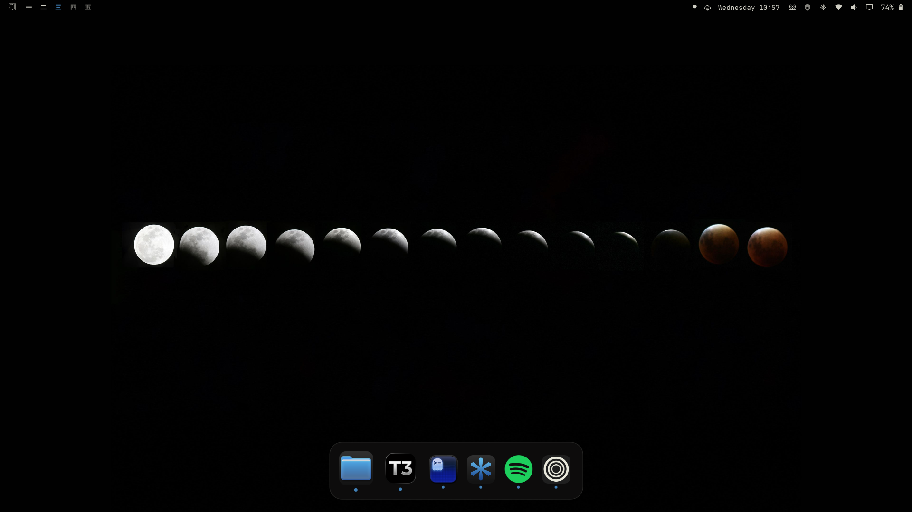

# macos.dock

A compact, bottom-centered macOS-inspired dock plugin for Omarchy.



## Features

- Glassy floating dock surface
- Subtle hover scaling and application tooltips
- Pinned application persistence
- Running-application indicators
- Pin, unpin, new-window, and close actions
- Conflict detection for `rosakodu.dock`
- Custom macOSicons, local PNG, and WebP icon overrides

## Install

Copy this directory to:

```text
~/.config/omarchy/plugins/macos.dock
```

Enable `macos.dock` through Omarchy's normal plugin configuration. The dock stores pins in:

```text
~/.config/omarchy/dock-pinned-macos.json
```

## Requirements and removal

This plugin requires Omarchy with Quickshell, plus `bash`, `curl`, `python3`,
ImageMagick (`magick` or `convert` and `identify`), and `xdg-open` for the
optional custom-icon helper.

For the best experience, use **floating windows** (not tiling): the dock is
designed to work with a floating layout where windows overlap its surface, and
it behaves best when windows are allowed to float over it rather than being
tiled up to its edges.

To remove the plugin, disable it and delete its installed directory:

```bash
omarchy plugin disable macos.dock
rm -rf ~/.config/omarchy/plugins/macos.dock
omarchy restart shell
```

The plugin does not overwrite existing Omarchy or user configuration files.
It only creates or updates its own files under `~/.config/omarchy/` after the
user explicitly invokes a dock action or the custom-icon helper. Custom icon
files and mappings can be removed with `omarchy-dock-icon clear <app-id>`.

The repository author owns this plugin and has permission to submit the source
code and preview assets. External icons downloaded from macOSicons remain
subject to their respective rights and terms; users should only use assets
they are permitted to use.

Plugin-directory approval is for listing in the Omarchy plugin directory and
is not a security review or endorsement. Review the source and dependencies
before installing.

## Custom icons

Use the helper to assign an icon from macOSicons, a direct image URL, or a
local image:

```bash
omarchy-dock-icon set code figma-i3FsrkYvf6
omarchy-dock-icon set code --file ~/Pictures/code.png
omarchy-dock-icon list
omarchy-dock-icon clear code
omarchy-dock-icon folder
```

The dock visibility shortcut is `SUPER + H`. It can also be controlled from a
terminal:

```bash
omarchy-shell macos.dock hide
omarchy-shell macos.dock show
omarchy-shell macos.dock toggle
```

Icons are normalized into transparent macOS-style rounded PNGs and metadata is
stored in `~/.config/omarchy/icons/` and `~/.config/omarchy/dock-icons.json`.
Changes are watched and applied without restarting the shell. The helper is installed at
`~/.local/bin/omarchy-dock-icon`.

## Development

```bash
./tests/run.sh
qmllint DockPanel.qml DockItem.qml DockMenu.qml
```

The dock is intended for a single primary output and uses the first configured Quickshell screen.
